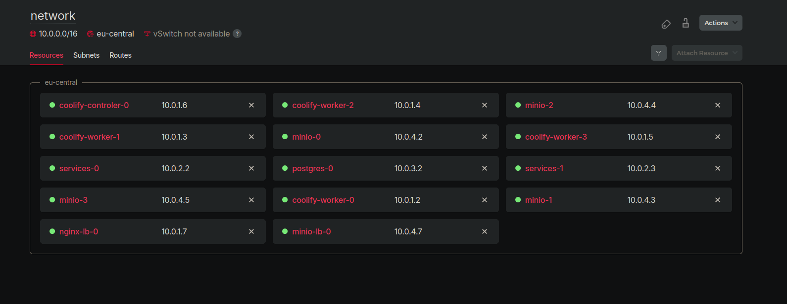
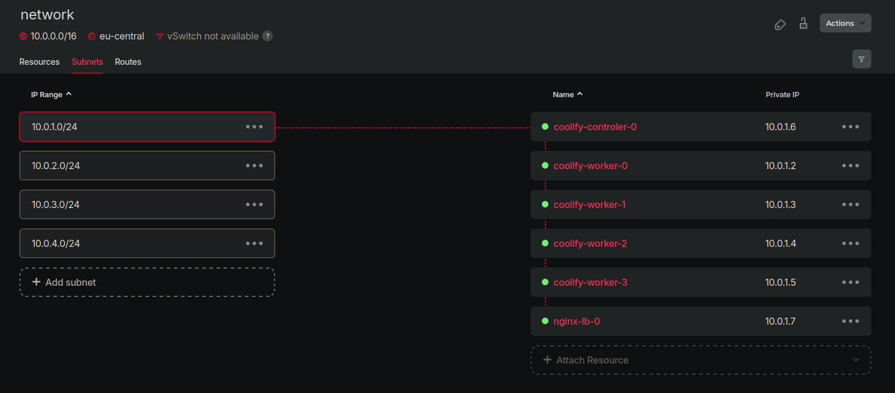
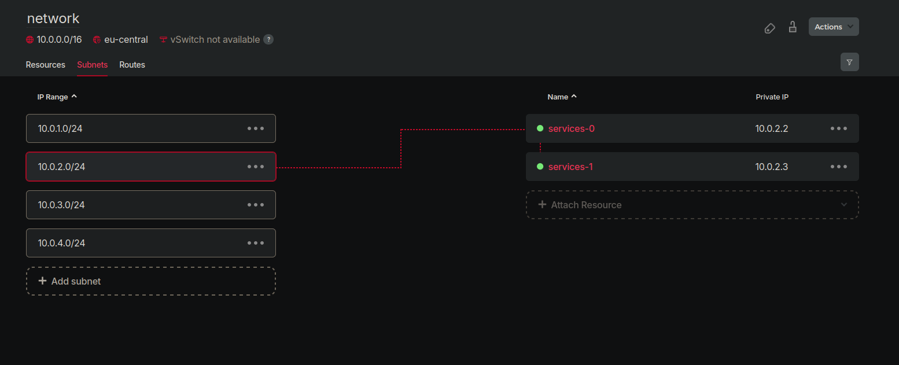
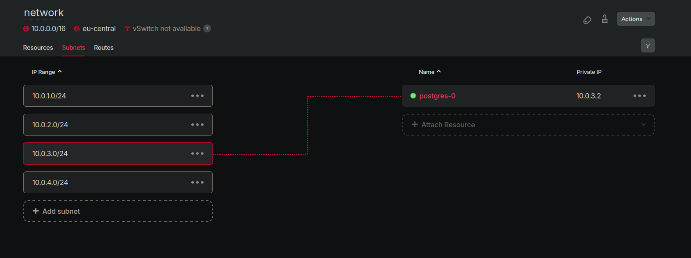
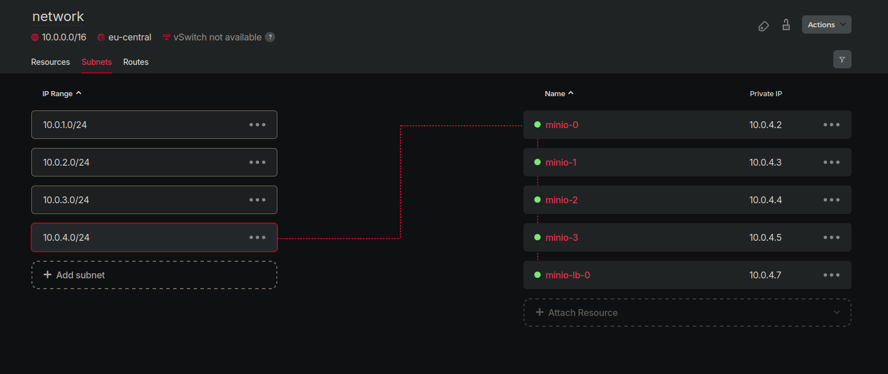

## Create infrastructure

Creating and configuring infrastructure processes depends on the resources you choose, and it will be explained in the playbook section

## Prerequisites

Before you begin, ensure you have the following:

- [Hetzner](https://hetzner.cloud/?ref=Ix9xCKNxJriM) Cloud account
- [Terraform](https://www.terraform.io/downloads.html)
- [Ansible](https://docs.ansible.com/ansible/latest/installation_guide/intro_installation.html)

## Deployment Steps

### 1. Generate Hetzner API Token

Create new project in Hetzner [console](https://console.hetzner.cloud/projects)

Obtain API token from Hetzner console that will be used by Terraform to interact with the platform.
Navigate to your project and click on SECURITY > API TOKENS > GENERATE API (give read/write access)

Paste API token in the `.auto.tfvars`. This will overwrite default values in `variables.tf` file.

---

### 2. Configure infrastructure

Choose how many servers you want to have in your cluster, what type, which part of infrastructure you want to deploy, etc:

```bash
hcloud_token = "xxxxxxxxxxxxxxxxxxxxxxxxxxxxxxxxx"

location_list     = ["fsn1", "nbg1", "hel1"]

instances_lb      = "1"
instances_minio_lb = "1"
instances_coolify_controler = "1"
instances_coolify_worker = "4"
instances_db      = "1"
instances_services = "2"
instances_minio   = "4"

server_type_coolify_controler = "cx11"
server_type_coolify_worker     = "cx21"
server_type_db       = "cx41"
server_type_services = "cx21"
server_type_minio    = "cx21"

os_type        = "ubuntu-22.04"
disk_size      = "10"
volumes_per_node = "4"
public_net     = true
```

### 3. Initialize and Apply Terraform

Initialize Terraform and apply the configuration:

```shell
cd hetzner-infra
terraform init --upgrade
terraform validate
terraform apply -auto-approve
```

When Terraform finishes with infrastructure creation, you need the private and public server IPs. Public IPs are needed for setting up necessary installation and configuration with Ansible. Private IPs will be used by servers for communication and load balancing for distributing traffic. When the infrastructure is up and running, we can disable public IPs and the only entry point would be our load balancer.

Terraform creates SSH private and public keys that are added to Hetzner and servers. They are also used by Ansible. Be careful with keys, you don't want to lose them.

Terrafrom outputs:

```bash
server_ips = {
  "coolify_controler" = {
    "coolify-controler-0" = "167.235.253.176"
  }
  "coolify_worker" = {
    "coolify-worker-0" = "157.90.252.123"
    "coolify-worker-1" = "168.119.165.118"
    "coolify-worker-2" = "65.109.2.124"
    "coolify-worker-3" = "49.13.126.247"
  }
  "minio" = {
    "minio-0" = "91.107.198.134"
    "minio-1" = "49.13.167.104"
    "minio-2" = "65.109.141.80"
    "minio-3" = "159.69.241.156"
  }
  "minio_lb" = {
    "minio-lb-0" = "157.90.150.92"
  }
  "nginx_lb" = {
    "nginx-lb-0" = "167.235.243.221"
  }
  "postgres_db" = {
    "postgres-0" = "88.198.111.144"
  }
  "services" = {
    "services-0" = "168.119.101.156"
    "services-1" = "167.235.30.10"
  }
}
server_status = {
  "coolify_controler" = {
    "coolify-controler-0" = "running"
  }
  "coolify_worker" = {
    "coolify-worker-0" = "running"
    "coolify-worker-1" = "running"
    "coolify-worker-2" = "running"
    "coolify-worker-3" = "running"
  }
  "minio" = {
    "minio-0" = "running"
    "minio-1" = "running"
    "minio-2" = "running"
    "minio-3" = "running"
  }
  "minio_lb" = {
    "minio-lb-0" = "running"
  }
  "nginx_lb" = {
    "nginx-lb-0" = "running"
  }
  "postgres_db" = {
    "postgres-0" = "running"
  }
  "services" = {
    "services-0" = "running"
    "services-1" = "running"
  }
}
```

Reasurces:


Subnets:





### 4. Configure Ansible hosts

Add Ip addresses to the `hosts` file.

```bash
[coolify-controler]
167.235.253.176

[coolify-worker]
157.90.252.123
168.119.165.118
65.109.2.124
49.13.126.247

[services]
168.119.101.156
167.235.30.10

[db]
88.198.111.144

[minio]
91.107.198.134
49.13.167.104
65.109.141.80
159.69.241.156

[nginx-minio-lb]
157.90.150.92

[nginx-lb]
167.235.243.221
```
Now we are ready to configure individual playbooks and run them. This will install the required dependencies and configure our servers.

### 5. Destroy infrastructure

To destroy the infrastructure run the following command:

```shell
terraform destroy -auto-approve
```
