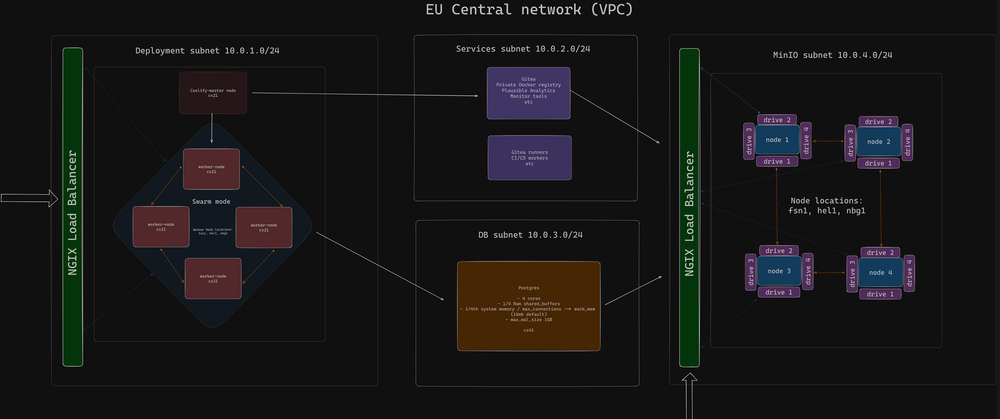

##  Deployment Cluster with S3 and psql




## Project Structure

Here's an overview of the project structure 

```bash
./
├── ansible/
│   ├── inventory/
│   │   └── hosts
│   ├── playbooks/
│   │   ├── roles/
│   │   │   ├── common/
│   │   │   ├── minio/
│   │   │   ├── nginx/
│   │   │   └── postgresql/
│   │   ├── templates_config/
│   │   │   ├── coolify_lb/
│   │   │   ├── minio_lb/
│   │   │   ├── scripts/
│   │   │   ├── ssl/
│   │   │   ├── playbook_install_python.yml
│   │   │   └── playbook_minio_preconfig.yml
│   │   ├── playbook_install_coolify.yml
│   │   ├── playbook_minio.yml
│   │   ├── playbook_nginx_coolify_lb.yml
│   │   ├── playbook_nginx_minio_lb.yml
│   │   └── playbook_psql.yml
│   ├── ansible.cfg
│   └── requirements.yml
└── terraform-hetzner/
    ├── db.tf
    ├── load_balancer.tf
    ├── main.tf
    ├── minio.tf
    ├── network.tf
    ├── output.tf
    ├── provider.tf
    ├── ssh.tf
    ├── terraform.tfstate
    ├── terraform.tfstate.backup
    └── variabels.tf
```